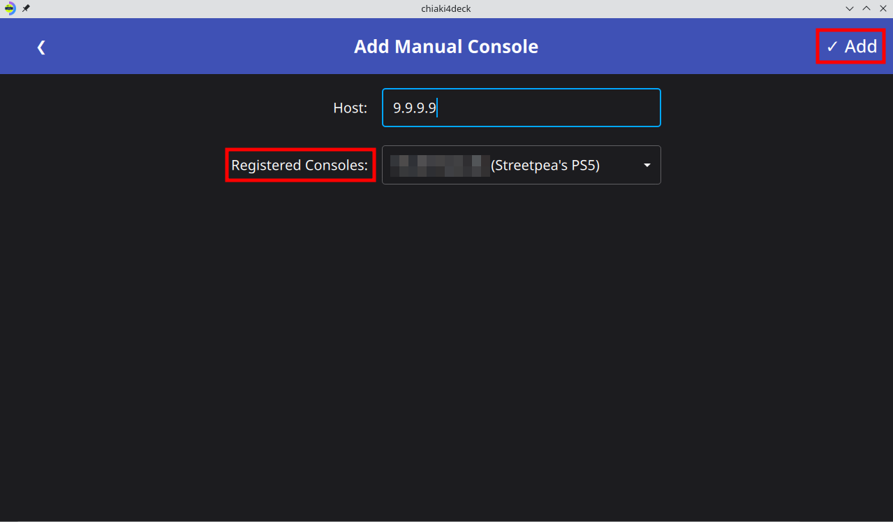

# Set up chiaki4deck to work outside of your home network

## Set Static IP

In order to prevent your IP from changing which would break the port forwarding rules if you ever disconnect your PlayStation console from your network and reconnect it (especially if other devices are added to the network in the meantime), you should go into your router settings and reserve an IP address for your PlayStation (DHCP IP reservation / "static" IP) or create a hostname for it. For a TP-Link, Netgear, Asus or Linskys router, follow [these instructions](https://www.coolblue.nl/en/advice/assign-fixed-ip-address-router.html){target="_blank" rel="noopener"}. If you have a different router, you can search (using a search engine such as DuckDuckGo or Google) for instructions for that specific router using the formula "dhcp reservation myroutername router" such as "dhcp reservation netgear router" and follow the instructions to reserve an IP for your PlayStation console so that it won't change. Alternatively, if your router has an option to set hostnames for your devices, you can set a hostname for your PlayStation console and use your hostname in the automation instead of a static IP address.

## Port Forwarding

Forward the ports for your console on your router following [this port forwarding guide starting with selecting your router](https://portforward.com/router.htm){target="_blank" rel="noopener"}

!!! Tip "Close out of ads"

    If any ads appear as you navigate the website just hit the close button on the given advertisement to continue on your journey.

=== "PS5"

    | Port | Connection Type |
    | ---- | --------------- |
    | 9295 | TCP             |
    | 9296 | UDP             |
    | 9297 | UDP             |
    | 9302 | UDP             |

=== "PS4"

    | Port | Connection Type |
    | ---- | --------------- |
    | 987  | UDP             |
    | 9295 | TCP             |
    | 9296 | UDP             |
    | 9297 | UDP             |

## Find Router's IP

On a computer connected to your router such as your Steam Deck (make sure to disconnect from a vpn first if you're connected to one to get the right IP) use one of the following:

=== "Browser"

    Visit [whatismyip](https://www.whatismyip.com){target="_blank" rel="noopener"} in your browser and copy the displayed IP

=== "Konsole/terminal"

    ``` bash
    curl checkip.amazonaws.com
    ```

## Test Connection

=== "GUI"

    1. Add console to GUI using remote IP as a new manual connection

        1. Click the plus icon in the main menu

            

        2. Create your remote connection

            

            1. Enter your remote IP/DNS

            2. Choose the locally registered console you want to remotely connect to

            3. Click Add
    
    2. Connect using this new connection

=== "Automation"

    Add your remote IP in the automation script when going through the next ([automation](automation.md){target="_blank" rel="noopener"}) section. Once setup on your local network, try to launch the PlayStation when connected to a different network such as a mobile hotspot.

!!! Question "If my connection stops working, what should I do?"

    If the connection stops working please make sure that the IP address for your router hasn't changed by checking it again via one of the methods above or a different one to make sure it's the same. If it has changed, you will need to update to the new IP address of your router.

